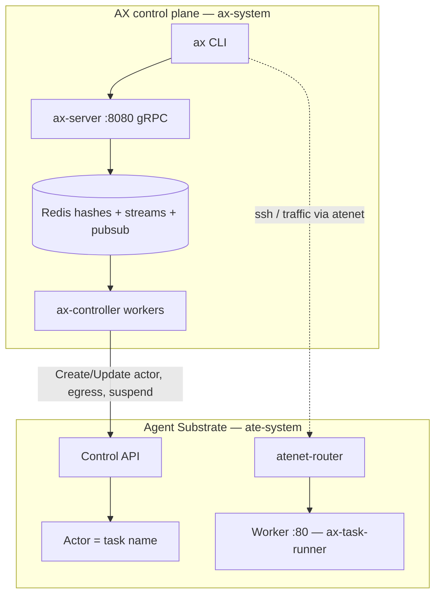
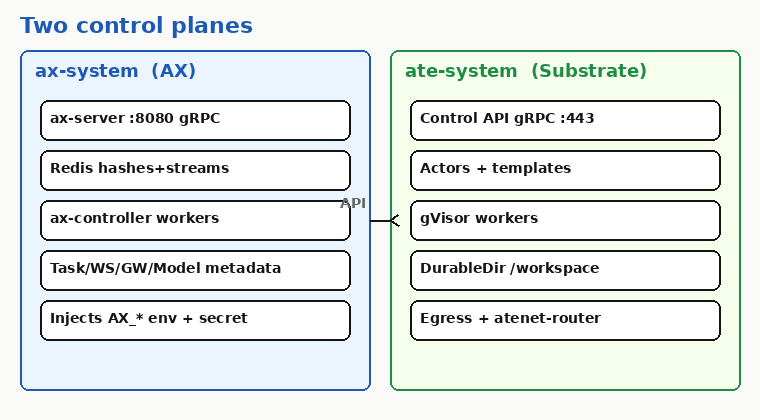
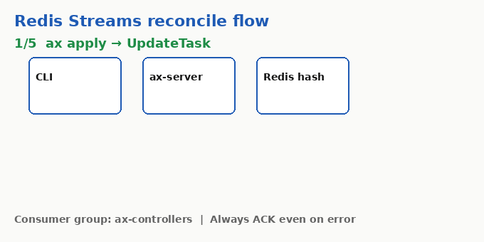
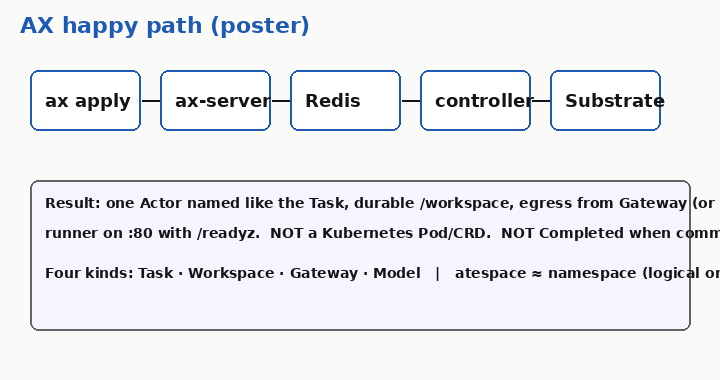

# AX-disect

First-principles learning notes for [google/ax](https://github.com/google/ax) — Google's declarative orchestrator for sandboxed agent workloads on Agent Substrate.

Built for **Kubernetes-fluent engineers** and **architects teaching juniors**: map AX objects and control-plane paths to familiar k8s mental models, then show where the analogy breaks.

## What this is / is not

| This repo **is** | This repo **is not** |
|------------------|----------------------|
| Original teaching material and verified path cites into `google/ax` | A fork or mirror of upstream AX |
| A curriculum under `learn/` (twelve subject teach-kits) | Runtime code you deploy as AX |
| Notes tagged Confident / Likely / Unknown against real Go/proto/deploy paths | Marketing docs or an official Google product guide |

Upstream source of truth: **[google/ax](https://github.com/google/ax)**. Re-verify cited paths when upstream moves.

## Quick start (first visit)

1. Skim this page — especially the architecture diagram and reading paths below.
2. Open the curriculum index: [`learn/README.md`](learn/README.md).
3. Orient with the map: [`learn/ax-subjects/00-map/`](learn/ax-subjects/00-map/README.md) (happy-path poster + mermaid).
4. Pick a path:
   - **Architects:** 00 → 05 → 08 → 11, then deepen 01–04 / 06–07 / 09–10 as needed.
   - **Juniors:** follow 00 → 01 → 05 → 08 → 06 → 02–04 → 07 → 09 → 10, keep 11 open as the drift log.
5. For each subject: speak **Say this first**, contrast the **Kubernetes analogy** with **Where it breaks**, walk the diagram, then do the **Junior exercise**.

No live AX cluster is required for most exercises — file reads and upstream GitHub raw links are enough.

## Architecture overview

AX is a Redis-backed gRPC control plane. Agent Substrate runs the sandboxes. Failure domains are split: `ax-system` vs `ate-system`.

**Two planes at a glance:**

**Control-plane stream flow (apply → Redis → workers):**

**Happy path poster (map subject):**

## Reading paths

### Architects (teach / design review)

| Order | Subject | Why |
|-------|---------|-----|
| 1 | [00-map](learn/ax-subjects/00-map/README.md) | Whole-system picture |
| 2 | [05-control-plane](learn/ax-subjects/05-control-plane/README.md) | Redis streams, reconciliation, no CRDs |
| 3 | [08-substrate](learn/ax-subjects/08-substrate/README.md) | Boundary and split failure domains |
| 4 | [11-doc-vs-code](learn/ax-subjects/11-doc-vs-code/README.md) | Drift register — trust code over prose |
| 5+ | 01–04, 06–07, 09–10 | Depth on primitives, runner, networking, ops |

### Juniors (guided curriculum)

| Order | Subject | Focus |
|-------|---------|--------|
| 1 | [00-map](learn/ax-subjects/00-map/README.md) | Orientation |
| 2 | [01-task](learn/ax-subjects/01-task/README.md) | Isolated execution unit |
| 3 | [05-control-plane](learn/ax-subjects/05-control-plane/README.md) | How apply becomes work |
| 4 | [08-substrate](learn/ax-subjects/08-substrate/README.md) | What AX does *not* run |
| 5 | [06-runner-sandbox](learn/ax-subjects/06-runner-sandbox/README.md) | PID1 contract on :80 |
| 6 | [02](learn/ax-subjects/02-workspace/README.md) · [03](learn/ax-subjects/03-gateway/README.md) · [04](learn/ax-subjects/04-model/README.md) | Workspace, Gateway, Model |
| 7 | [07-networking-atenet](learn/ax-subjects/07-networking-atenet/README.md) | Header routing, not Services |
| 8 | [09-cli-ops](learn/ax-subjects/09-cli-ops/README.md) · [10-scale](learn/ax-subjects/10-scale-failure-modes/README.md) | Ops and failure modes |
| always | [11-doc-vs-code](learn/ax-subjects/11-doc-vs-code/README.md) | Living mismatch log |

Full index, session shape, and confidence legend: **[`learn/README.md`](learn/README.md)**.

## Subject index (quick links)

| # | Topic |
|---|--------|
| [00](learn/ax-subjects/00-map/README.md) | Map — index & k8s mental-model |
| [01](learn/ax-subjects/01-task/README.md) | Task |
| [02](learn/ax-subjects/02-workspace/README.md) | Workspace |
| [03](learn/ax-subjects/03-gateway/README.md) | Gateway |
| [04](learn/ax-subjects/04-model/README.md) | Model |
| [05](learn/ax-subjects/05-control-plane/README.md) | Control plane |
| [06](learn/ax-subjects/06-runner-sandbox/README.md) | Runner / sandbox |
| [07](learn/ax-subjects/07-networking-atenet/README.md) | Networking (atenet) |
| [08](learn/ax-subjects/08-substrate/README.md) | Agent Substrate boundary |
| [09](learn/ax-subjects/09-cli-ops/README.md) | CLI & ops |
| [10](learn/ax-subjects/10-scale-failure-modes/README.md) | Scale & failure modes |
| [11](learn/ax-subjects/11-doc-vs-code/README.md) | Doc vs code drift |

### Diagram plates (also embedded in subjects)

| Asset | Subject |
|-------|---------|
| [happy-path.png](learn/ax-subjects/00-map/assets/happy-path.png) | 00-map |
| [maiden-checklist.png](learn/ax-subjects/02-workspace/assets/maiden-checklist.png) | 02-workspace |
| [model-vs-secret.png](learn/ax-subjects/04-model/assets/model-vs-secret.png) | 04-model |
| [stream-flow.gif](learn/ax-subjects/05-control-plane/assets/stream-flow.gif) | 05-control-plane |
| [two-planes.png](learn/ax-subjects/08-substrate/assets/two-planes.png) | 08-substrate |
| [amplification.png](learn/ax-subjects/10-scale-failure-modes/assets/amplification.png) | 10-scale |
| [traffic-light.png](learn/ax-subjects/11-doc-vs-code/assets/traffic-light.png) | 11-doc-vs-code |

## License

Teaching content in this repository is original material by the owner, licensed under [MIT](LICENSE). It is **not** a copy of the `google/ax` license or source tree. Upstream AX remains under its own license at [google/ax](https://github.com/google/ax).

## Contributor

- **Sushant** ([@sushant24-ai](https://github.com/sushant24-ai)) — curriculum author and maintainer
