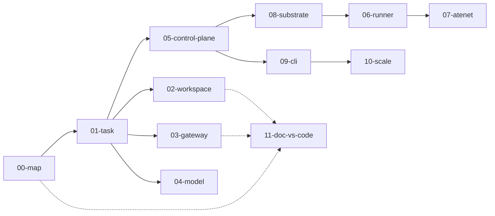

# AX learning curriculum

This directory is a **dissection curriculum** for [google/ax](https://github.com/google/ax) - Google's declarative orchestrator for sandboxed agent workloads on [Agent Substrate](https://github.com/agent-substrate/substrate).

**AX-disect does not fork or modify upstream.** Claims are verified against a local checkout of `google/ax` (for example `/tmp/google-ax`). When upstream changes, re-read the cited paths.

## How to teach from these kits

Each subject under `ax-subjects/` is a **one-page teach kit** for architects training junior engineers.

**Session shape (≈20 - 40 min per subject):**

1. Speak **Say this first** aloud (2 - 4 sentences). No slides needed.
2. Give the **Kubernetes analogy** in one sentence, then immediately the **Where the analogy breaks** bullets - that contrast is the lesson.
3. Walk the **Big picture diagram** (mermaid or `assets/` image). Have juniors narrate the arrows.
4. Call out the **Wrong mental model** - ask who believed it.
5. Skim **Niche findings** (Confident / Likely / Unknown). Do not invent Confidence.
6. Run the **Junior exercise** (usually a file read or `curl` of raw GitHub - no live cluster required).
7. Leave **deeper sections** as homework / office-hours depth.

**Prerequisites:** comfort with Kubernetes concepts (Pods, Services, controllers), basic YAML, and willingness to read Go paths. No live AX cluster required for most exercises.

**Time box:** 00-map half day orientation; 01 - 08 one subject per sitting; 09 - 10 ops day; 11 drift log always open beside the others.

## How to use this (self-serve)

1. Start at [`ax-subjects/00-map/`](ax-subjects/00-map/README.md).
2. Work **01 - 10** in order, or jump to a primitive.
3. Keep [`ax-subjects/11-doc-vs-code/`](ax-subjects/11-doc-vs-code/README.md) open as the living drift log.

## Teach-kit skeleton (every subject)

| Section | Purpose |
|---------|---------|
| Say this first | Spoken opener |
| Kubernetes analogy + breaks | Familiar hook + trap doors |
| Big picture diagram | Mermaid (required); optional `assets/` PNG/GIF |
| Wrong mental model | k8s-person mistake → AX truth |
| Niche findings | Confident/Likely/Unknown + path cites |
| Junior exercise | One concrete check |
| Deeper sections | Design, architecture path, operator notes, open questions |

Non-trivial claims are tagged **Confident** (upstream path), **Likely**, or **Unknown**.

## Subject index

| # | Folder | Topic |
|---|--------|-------|
| 00 | [`ax-subjects/00-map/`](ax-subjects/00-map/README.md) | Index, reading order, k8s mental-model map |
| 01 | [`ax-subjects/01-task/`](ax-subjects/01-task/README.md) | Task - isolated execution unit |
| 02 | [`ax-subjects/02-workspace/`](ax-subjects/02-workspace/README.md) | Workspace - git, MCP, skills, warm start |
| 03 | [`ax-subjects/03-gateway/`](ax-subjects/03-gateway/README.md) | Gateway - egress allowlists |
| 04 | [`ax-subjects/04-model/`](ax-subjects/04-model/README.md) | Model - platform LLM configuration |
| 05 | [`ax-subjects/05-control-plane/`](ax-subjects/05-control-plane/README.md) | Control plane - gRPC, Redis, reconciliation |
| 06 | [`ax-subjects/06-runner-sandbox/`](ax-subjects/06-runner-sandbox/README.md) | Runner/sandbox contract |
| 07 | [`ax-subjects/07-networking-atenet/`](ax-subjects/07-networking-atenet/README.md) | atenet routing and reachability |
| 08 | [`ax-subjects/08-substrate/`](ax-subjects/08-substrate/README.md) | Agent Substrate boundary |
| 09 | [`ax-subjects/09-cli-ops/`](ax-subjects/09-cli-ops/README.md) | `ax` CLI and deploy path |
| 10 | [`ax-subjects/10-scale-failure-modes/`](ax-subjects/10-scale-failure-modes/README.md) | Agents at scale, failure modes |
| 11 | [`ax-subjects/11-doc-vs-code/`](ax-subjects/11-doc-vs-code/README.md) | Verified doc-vs-code drift log |

## Upstream references

| Resource | Path in `google/ax` |
|----------|---------------------|
| Architecture overview | [`DESIGN.md`](https://github.com/google/ax/blob/main/DESIGN.md) |
| Concepts | [`docs/concepts.md`](https://github.com/google/ax/blob/main/docs/concepts.md) |
| Manifests | [`docs/manifests.md`](https://github.com/google/ax/blob/main/docs/manifests.md) |
| Sandbox / runner / networking | [`docs/sandbox.md`](https://github.com/google/ax/blob/main/docs/sandbox.md), [`docs/runner.md`](https://github.com/google/ax/blob/main/docs/runner.md), [`docs/networking.md`](https://github.com/google/ax/blob/main/docs/networking.md) |
| API schema | [`pkg/apis/v1alpha1/ax.proto`](https://github.com/google/ax/blob/main/pkg/apis/v1alpha1/ax.proto) |
| Example manifests | [`examples/task.yaml`](https://github.com/google/ax/blob/main/examples/task.yaml), [`examples/simple.yaml`](https://github.com/google/ax/blob/main/examples/simple.yaml) |

**Note:** `examples/multi-workspace.yaml` is cited in upstream `docs/manifests.md` but **does not exist** on `main` (404). Use `examples/task.yaml` + proto for multi-binding shape. See [`11-doc-vs-code`](ax-subjects/11-doc-vs-code/README.md).

## Claim confidence legend

- **Confident** - verified in upstream Go/proto/deploy code; path cited.
- **Likely** - consistent with docs and partial code paths, not fully traced.
- **Unknown** - not found in code reviewed; may be planned or doc-only.
