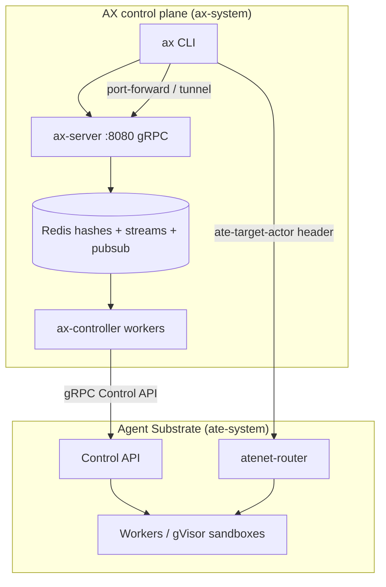
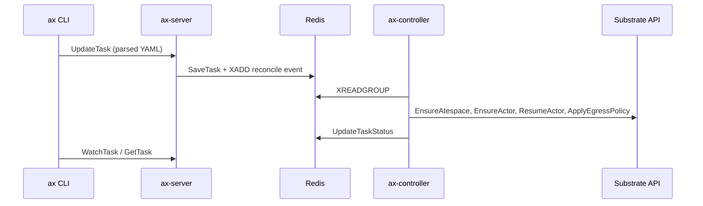

# 00 — Map

## Say this first

AX is not “Kubernetes for agents.” It is a Redis-backed gRPC control plane that turns four YAML kinds into Agent Substrate actors. A Task is one sandboxed actor with a durable `/workspace`, optional egress rules, and a fixed runner on port 80. Think declarative UX like kubectl — storage and execution are Redis and Substrate, not etcd and kubelet.

## Kubernetes analogy (one sentence)

`ax apply` feels like `kubectl apply`, but the API server is `ax-server`, the database is Redis, and the “pod” is a Substrate Actor.

### Where the analogy breaks

- No Task CRDs in the cluster — YAML is parsed **client-side**; server gets typed gRPC. **Confident** — [`pkg/apis/v1alpha1/ax.proto`](https://github.com/google/ax/blob/main/pkg/apis/v1alpha1/ax.proto) L26–27.
- Gateway listeners look like Service ports but are **not reconciled**; only egress is applied. **Confident** — reconciler calls `ApplyEgressPolicy` only.
- Reachability is **header routing** (`ate-target-actor`), not a Service per task. **Confident** — [`docs/networking.md`](https://github.com/google/ax/blob/main/docs/networking.md).
- Suspend is Substrate **snapshot**, not Deployment scale-to-zero.
- `Completed` is language CLI/watch know — the controller **never sets** that phase.

## Big picture diagram

Happy-path story: `ax apply -f examples/task.yaml` → `UpdateTask` → Redis hash + stream event → controller `XREADGROUP` → `EnsureActor` / egress / resume → runner maiden setup → `/readyz` → phase `Running`.

## Wrong mental model

**Mistake:** “Tasks are Pods; when my command exits the Task Completes like a Job.”

**Correct:** Entrypoint is always `ax-task-runner`; `spec.command` is a child. Command exit is logged; phase stays `Running` unless you suspend/delete/fail Substrate. `Completed` is never written by the reconciler.

## Niche findings

- **Confident** — Four kinds only; only Task has status. [`ax.proto`](https://github.com/google/ax/blob/main/pkg/apis/v1alpha1/ax.proto).
- **Confident** — Default egress when no Gateway: `*:443`. [`internal/controller/reconciler.go`](https://github.com/google/ax/blob/main/internal/controller/reconciler.go) ~L193–198.
- **Confident** — Consumer group `ax-controllers` on stream `ax:stream:tasks`. [`internal/store/redis/store.go`](https://github.com/google/ax/blob/main/internal/store/redis/store.go), [`internal/controller/worker.go`](https://github.com/google/ax/blob/main/internal/controller/worker.go).
- **Likely** — “Billions of tasks per cluster” is design slogan; no benchmark in repo.
- **Unknown** — Horizontal ax-server under load (deploy default replicas: 1; server is stateless so likely OK).

## Junior exercise

Open [`examples/task.yaml`](https://github.com/google/ax/blob/main/examples/task.yaml). List the four `kind:` documents. Predict: after apply, what Redis key patterns appear (`ax:task:…`, stream name), and what Substrate actor name equals. Check your prediction against [`00` architecture path](#architecture-path-upstream) and subject 05.

## One-line definition

AX is a **Redis-backed, gRPC control plane** that reconciles four manifest kinds (`Task`, `Workspace`, `Gateway`, `Model`) into **Agent Substrate actors** — sandboxed containers with durable `/workspace` volumes, optional egress policy, and a runner contract on port 80.

## Kubernetes metaphor (table)

| AX | Rough k8s analogue | What it actually is |
|----|-------------------|---------------------|
| `ax apply -f` | `kubectl apply` | Client parses YAML → typed gRPC `Update*` RPCs |
| `ax-server` | kube-apiserver | Stateless gRPC + `/healthz`; persists to Redis |
| `ax-controller` | controller-manager | Redis Stream consumer; drives Substrate |
| `Task` | Pod + Job hybrid | One actor per task; suspend/resume via Substrate snapshots |
| `Workspace` | PVC + initContainer | Declarative prep; runner materializes on maiden boot |
| `Gateway` | NetworkPolicy + egress proxy | **Only egress allowlist is applied today** |
| `Model` | ConfigMap/Secret for LLM | Stored in Redis; partial wiring to runtime |
| `atespace` | namespace | Logical partition; maps to Substrate atespace |
| `ax ssh` | `kubectl exec` | Guest gRPC via atenet when `spec.debug: true` |
| Agent Substrate | kubelet + CRI + CNI | External project; AX calls its Control API |

## Why it exists (first principles)

Agents differ from microservices and batch jobs:

- **Long-lived, stateful, money-burning** — need cheap suspend and explicit network fences.
- **Environment-heavy** — git, tools, MCP, skills before first useful action.
- **High cardinality** — short tasks stress etcd-style control planes.

AX keeps declarative UX while moving task state to Redis and execution to Substrate. **Confident** — [`README.md`](https://github.com/google/ax/blob/main/README.md), [`DESIGN.md`](https://github.com/google/ax/blob/main/DESIGN.md).

## Design — objects and ownership

| Kind | Scoped by | Spec owner | Status owner |
|------|-----------|------------|--------------|
| Task | `metadata.atespace`, `metadata.name` | User via `UpdateTask` | Controller writes `status` |
| Workspace | same | User | No status in v1alpha1 |
| Gateway | same | User | No status |
| Model | same | User | No status |

Default atespace: `default`. **Confident** — [`internal/server/server.go`](https://github.com/google/ax/blob/main/internal/server/server.go).

## Architecture path (upstream)

| Layer | Packages / binaries |
|-------|---------------------|
| API schema | `pkg/apis/v1alpha1/` |
| API server | `cmd/ax-server`, `internal/server/` |
| Controller | `cmd/ax-controller`, `internal/controller/` |
| Store | `internal/store/`, `internal/store/redis/` |
| Substrate client | `internal/substrate/` |
| Runner | `cmd/ax-task-runner`, `runner/`, `internal/metadata/`, `internal/workspace/` |
| CLI | `cmd/ax/`, `internal/tunnel/`, `internal/guest/` |
| Deploy | `deploy/*.yaml`, `Makefile` |

## Recommended reading order

1. **01-task** — lifecycle hub  
2. **05-control-plane** — intent → reconciliation  
3. **08-substrate** — what AX does not own  
4. **06-runner-sandbox** — in-container contract  
5. **02 / 03 / 04** — spec primitives  
6. **07 / 09** — networking and CLI  
7. **10 / 11** — scale realism and drift  

## Operator notes (at scale)

- Scale **ax-controller** replicas (consumer group), not only ax-server. **Confident** — [`worker.go`](https://github.com/google/ax/blob/main/internal/controller/worker.go), [`deploy/ax-controller.yaml`](https://github.com/google/ax/blob/main/deploy/ax-controller.yaml).
- Redis is the durability SPOF for AX metadata.
- Substrate workers/snapshots are the execution bottleneck.
- Tighten Gateway egress before untrusted agents. Default `*:443`.

## Open questions

| Claim | Tag |
|-------|-----|
| "Billions of tasks per cluster" | **Likely** — slogan; no benchmarks |
| Budget/approval `policies` on Task | **Confident removed** — reserved proto fields |
| `status.phase: Completed` | **Confident never set** by reconciler |
| Horizontal ax-server | **Unknown** — replicas: 1 in deploy |

See [`11-doc-vs-code/`](../11-doc-vs-code/README.md).
