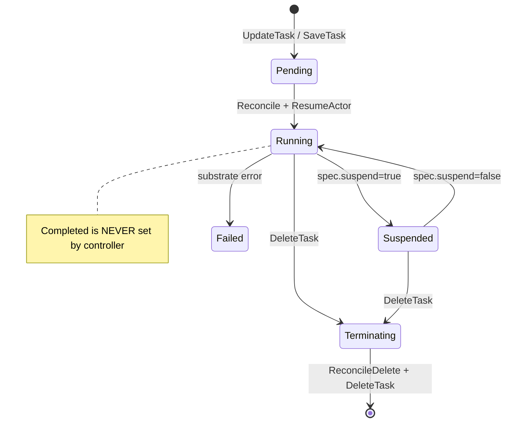

# 01 — Task

## Say this first

A Task is one isolated agent sandbox. AX stores it in Redis and asks Substrate for one Actor with the **same name** as the task. The container always starts `ax-task-runner`; your `spec.command` is a child process. Phases you can trust from the controller are Pending, Running, Suspended, Failed, Terminating — not Completed.

## Kubernetes analogy (one sentence)

A Task is a Pod+Job hybrid: one sandboxed actor, suspend like a paused workload, conditions like Pod conditions — but the entrypoint is fixed and Jobs’ “Completed” never appears.

### Where the analogy breaks

- No PodSpec, sidecars, or InitContainers — workspace setup is **runner** logic.
- `spec.command` is **not** container CMD; entrypoint is always `/usr/local/bin/ax-task-runner`. **Confident** — [`internal/substrate/client.go`](https://github.com/google/ax/blob/main/internal/substrate/client.go) `DefaultGuestCommand`.
- `spec.resources` is schema/examples only — **not** passed to Substrate. **Confident** — `BuildActorTemplate` has no CPU/mem.
- Delete is **two-phase** (Terminating → actor cleanup), not a single apiserver delete.

## Big picture diagram



## Wrong mental model

**Mistake:** “When my Python agent process exits, the Task becomes Completed and watch stops because we’re done.”

**Correct:** Runner stays up after command exit (metadata server keeps serving). Reconciler never writes `Completed`. `WatchTask` / CLI also treat `Running` as a stop condition — so watch can end while the sandbox is still alive. **Confident** — [`runner/runner.go`](https://github.com/google/ax/blob/main/runner/runner.go); [`internal/server/server.go`](https://github.com/google/ax/blob/main/internal/server/server.go) ~L233; reconciler phase writes.

## Niche findings

- **Confident** — Actor name = `task.Metadata.Name`. [`internal/controller/reconciler.go`](https://github.com/google/ax/blob/main/internal/controller/reconciler.go) ~L128.
- **Confident** — Conditions: `GatewayReady`, `WorkspaceReady` (sticky), `Ready` = running ∧ WorkspaceReady.
- **Confident** — Missing Workspace object → empty dir; task still reconciles. [`worker.go`](https://github.com/google/ax/blob/main/internal/controller/worker.go) ~L140–142.
- **Confident** — Worker **always ACKs** stream events even on reconcile error. [`worker.go`](https://github.com/google/ax/blob/main/internal/controller/worker.go) ~L64–66.
- **Confident** — Command exit does not fail the Task. [`runner/runner.go`](https://github.com/google/ax/blob/main/runner/runner.go) `reportExit`.
- **Likely** — Task trees / fan-out are conceptual only (no parent API in v1alpha1).

## Junior exercise

In a clone of google/ax, run: `grep -n 'Phase =' internal/controller/reconciler.go`. List every phase string assigned. Confirm `Completed` is absent. Then peek `WatchTask` in `internal/server/server.go` for which phases close the stream.

## One-line definition

A **Task** is the smallest unit of isolated agent execution: image, optional command, workspace bindings, gateway reference, and lifecycle status backed by one Substrate **Actor** named after the task.

## Design

### API sketch

**Confident** — [`pkg/apis/v1alpha1/ax.proto`](https://github.com/google/ax/blob/main/pkg/apis/v1alpha1/ax.proto)

```yaml
apiVersion: ax.io/v1alpha1
kind: Task
metadata:
  name: task123
  atespace: default
spec:
  suspend: false
  image: ""              # default: gcr.io/ax-substrate/ate-images/ax-task-runner
  command: ["python", "agent.py"]
  env: [{name: FOO, value: bar}]
  resources:             # schema only — see 11-doc-vs-code
    requests: {cpu: "500m", memory: "1Gi"}
  workspaces:
    - name: my-ws
      path: /workspace/my-ws
      goal: "Install deps"
  gateway:
    name: default-gateway
  debug: true
status:
  phase: Running
  actor: task123
  workerIP: 10.20.3.67
  conditions: [...]
```

### Validation

**Confident** — [`types.go`](https://github.com/google/ax/blob/main/pkg/apis/v1alpha1/types.go) `ValidateTask`: workspace names required/unique; paths absolute and non-colliding.

### Phases

| Phase | Set by | Meaning |
|-------|--------|---------|
| `Pending` | Store on first save | Saved, not yet Running |
| `Running` | Reconciler after ResumeActor | Actor active |
| `Suspended` | Reconciler when `spec.suspend` | Checkpointed; workerIP cleared |
| `Failed` | Reconciler on hard errors | Substrate/atespace failure |
| `Terminating` | Store on delete | Two-phase delete |
| `Completed` | — | **Never set by controller** |

### Conditions

| Type | True when |
|------|-----------|
| `GatewayReady` | Egress applied (warn+continue on failure) |
| `WorkspaceReady` | `/readyz?check=workspace` OK; sticky |
| `Ready` | Running **and** WorkspaceReady |

### Lifecycle RPCs

`GetTask`, `ListTasks`, `UpdateTask`, `DeleteTask`, `SuspendTask`, `ResumeTask`, `WatchTask`. **Confident** — [`internal/server/server.go`](https://github.com/google/ax/blob/main/internal/server/server.go).

**Delete is two-phase:** `MarkTaskDeleting` → Terminating → `ReconcileDelete` → `DeleteTask`.

## Architecture path

| Step | Code |
|------|------|
| Apply | `cmd/ax/main.go` → `UpdateTask` |
| Persist + event | `internal/store/redis/store.go` `SaveTask` |
| Consume | `internal/controller/worker.go` |
| Reconcile | `internal/controller/reconciler.go` |
| Env inject | `AX_TASK_YAML`, `AX_WORKSPACES_YAML`, `GEMINI_API_KEY` |
| Substrate | `internal/substrate/client.go` |

## Operator notes

- Use task name in `ate-target-actor` headers.
- Failed reconcile still ACKs — re-apply after fixing spec.
- `ax ssh` needs `Running` + `spec.debug: true`.
- Idle cost: `ax suspend` / `SuspendTask`.

## Open questions

| Item | Tag |
|------|-----|
| `spec.resources` enforced | **Confident not wired** |
| Command exit → Failed/Completed | **Confident not wired** |
| `pendingApproval` / budgets | **Confident unused** |
| Task tree / fan-out | **Likely** conceptual only |
