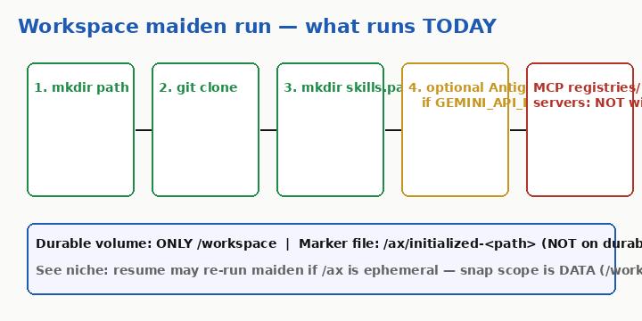
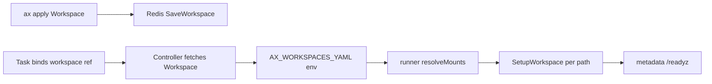

# 02 — Workspace

## Say this first

A Workspace declares what should appear on disk for agents — git repos, skills path, MCP intent. On maiden boot the runner clones git and mkdir’s skills. MCP registries and servers in YAML are **not materialized** by setup today. After success, a marker under `/ax` skips re-setup — but that marker is not on the durable `/workspace` volume.

## Kubernetes analogy (one sentence)

Workspace is like a PVC plus an initContainer: durable `/workspace` plus first-boot setup — except setup runs inside the task runner, not as a cluster init pod.

### Where the analogy breaks

- Workspace is a **Redis API object**, not a Volume CRD.
- Multiple workspaces = **subdirs under one durable volume**, not multiple PVCs. **Confident** — [`types.go`](https://github.com/google/ax/blob/main/pkg/apis/v1alpha1/types.go) `WorkspacePaths()`.
- Docs cite `examples/multi-workspace.yaml` — **file 404 on main**. Only `examples/simple.yaml` and `examples/task.yaml` exist.

## Big picture diagram





## Wrong mental model

**Mistake:** “MCP and skills registries in the Workspace YAML will install tools like an init container installs packages.”

**Correct:** **What runs today:** git clone + `MkdirAll` for `skills.path` + optional Antigravity if `GEMINI_API_KEY` is set. MCP blocks are schema/docs intent. **Confident** — [`internal/workspace/setup.go`](https://github.com/google/ax/blob/main/internal/workspace/setup.go) (`cloneRepos`, `setupSkills`; no MCP writer).

## Niche findings

- **Confident** — Maiden marker path: `/ax/initialized-<path>` (`DefaultAXDir = "/ax"`). [`setup.go`](https://github.com/google/ax/blob/main/internal/workspace/setup.go) L33–35, L101–125.
- **Confident** — Durable mount is **only** `/workspace`. [`BuildActorTemplate`](https://github.com/google/ax/blob/main/internal/substrate/client.go) `DurableDir` + `MountPath: "/workspace"`.
- **Likely gap** — On resume, if `/ax` is ephemeral and snapshot scope is DATA (workspace), marker may be gone → maiden re-runs (git into restored tree). Controller keeps `WorkspaceReady` sticky in Redis status regardless. See drift #13.
- **Confident** — `PlanEnvironment` only called from `planner_test.go`, not runner/controller.
- **Confident false cite fixed** — `examples/multi-workspace.yaml` **does not exist**. Upstream still links it from [`docs/manifests.md`](https://github.com/google/ax/blob/main/docs/manifests.md) ~L52. Multi-binding shape: Task `spec.workspaces[]` in [`examples/task.yaml`](https://github.com/google/ax/blob/main/examples/task.yaml) + proto.
- **Confident** — First workspace binding = cwd for `spec.command`. [`runner/runner.go`](https://github.com/google/ax/blob/main/runner/runner.go).

## Junior exercise

```bash
curl -sI https://raw.githubusercontent.com/google/ax/main/examples/multi-workspace.yaml | head -1
# expect 404
curl -sI https://raw.githubusercontent.com/google/ax/main/examples/task.yaml | head -1
# expect 200
```

Then `grep -n 'setupSkills\|MCP\|cloneRepos' internal/workspace/setup.go` in a local clone and list what functions actually run on maiden boot.

## One-line definition

A **Workspace** is a reusable declaration of filesystem/tool landscape that tasks bind via `spec.workspaces`; the runner materializes it on **maiden boot**.

## Design

### Spec

**Confident** — [`ax.proto`](https://github.com/google/ax/blob/main/pkg/apis/v1alpha1/ax.proto) `WorkspaceSpec`

```yaml
apiVersion: ax.io/v1alpha1
kind: Workspace
metadata:
  name: default-workspace
  atespace: default
spec:
  git:
    - name: origin
      repo: https://github.com/org/repo.git
      branch: main
      dir: .
  mcp: { registries: [...], servers: [...] }   # declared; not setup-wired
  skills:
    path: /.agents/skills
```

### Task binding

```yaml
spec:
  workspaces:
    - name: default-workspace
      path: /workspace
      goal: "Install dependencies and run tests"
```

`goal` is per-binding (TaskSpec top-level `goal` reserved/removed).

### What runs today (checklist)

| Step | Implemented |
|------|-------------|
| Git clone | Yes |
| Skills dir create | Yes — mkdir only |
| MCP registries/servers | **No** in setup.go |
| Goal bootstrap | Optional Antigravity if key present |
| Idempotency marker | `/ax/initialized-*` |

Bootstrap timeout default 10m (`AX_BOOTSTRAP_TIMEOUT`).

### WorkspaceReady

Controller polls `GET /readyz?check=workspace`. Runner sets ready after mounts succeed.

## Architecture path

| File | Role |
|------|------|
| `pkg/apis/v1alpha1/ax.proto` | Schema |
| `internal/controller/worker.go` | Resolve bound workspaces |
| `internal/controller/reconciler.go` | `marshalWorkspaces` → env |
| `internal/workspace/setup.go` | Git, skills, bootstrap |
| `internal/workspace/planner.go` | LLM plan helper (**tests only**) |
| `cmd/ax-task-runner/antigravity_bootstrap.py` | Goal script in default image |

## Operator notes

- Warm start depends on marker + durable git content — understand `/ax` vs `/workspace` before relying on resume.
- `GEMINI_API_KEY` comes from hardcoded secret lookup, not Model CR (see 04).
- Git failure → no marker → stuck initializing; use `ax ssh` with debug.

## Open questions

| Item | Tag |
|------|-----|
| MCP server wiring into agent runtime | **Unknown** / not in setup |
| Skill registry fetch | **Unknown** — mkdir only |
| Planner on hot path | **Confident no** — tests only |
| Workspace update → running tasks | **Likely** needs task re-apply |
