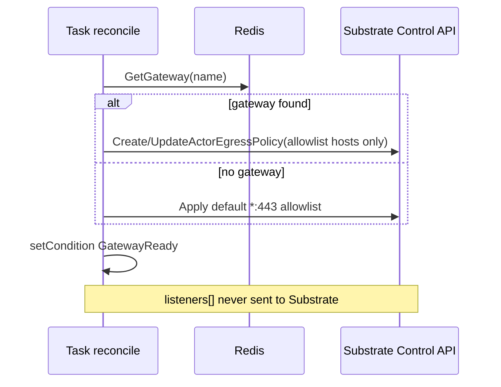

# 03 — Gateway

## Say this first

A Gateway is mostly an **egress allowlist** for tasks. Listeners in the YAML look important but AX does not open those ports for you. If a task has no gateway, the controller still applies a default allow-all on port 443 semantics at the Substrate policy layer — and the YAML `HostRule.port` field is ignored when building rules.

## Kubernetes analogy (one sentence)

Gateway is like a NetworkPolicy egress list attached to the actor — not like a Service that publishes listener ports.

### Where the analogy breaks

- **Listeners are not reconciled** — CLI may display them; controller never binds them. **Confident**.
- Inbound uses **atenet-router** + `ate-target-actor`, not Gateway listeners. **Confident** — [`docs/networking.md`](https://github.com/google/ax/blob/main/docs/networking.md).
- `HostRule.port` in proto/YAML does **nothing** in `ApplyEgressPolicy`. **Confident** — [`internal/substrate/client.go`](https://github.com/google/ax/blob/main/internal/substrate/client.go) L449–490 loops hosts, never reads `h.Port`.

## Big picture diagram



## Wrong mental model

**Mistake:** “I set listener port 8494 and HostRule port 443, so only 443 is allowed and my app is exposed on 8494.”

**Correct:** Egress rules are host/CIDR (or allow-all) **without port**. Listeners are documentation/display. Exposure is worker:80 via atenet. Port in YAML is documentation-only for enforcement.

## Niche findings

- **Confident** — Default when gateway missing: allowlist host `*` (see reconciler ~L193–198).
- **Confident** — Policy apply failure → `GatewayReady=False` but reconcile **continues**. reconciler ~L200–202.
- **Likely** — `SaveGateway` writes Redis hash/index only — **no** task stream `XADD`. Updating a Gateway alone does **not** re-reconcile tasks. Workaround: re-`ax apply` the Task (or otherwise publish a task reconcile). [`internal/store/redis/store.go`](https://github.com/google/ax/blob/main/internal/store/redis/store.go) `SaveGateway`.
- **Confident** — `*` / `0.0.0.0/0` → Substrate `EgressRule.All`; else hostname patterns or CIDRs.
- **Unknown** — Wildcard hostname semantics inside Substrate’s egress engine (out of tree).

## Junior exercise

Read `ApplyEgressPolicy` in [`internal/substrate/client.go`](https://github.com/google/ax/blob/main/internal/substrate/client.go). Confirm there is no use of `.Port`. Then invent a Gateway YAML with `port: 8443` on a host and write one sentence: “What Substrate actually receives.”

## One-line definition

A **Gateway** declares network boundaries: **listeners** (ingress intent, unused by reconciler) and an **egress allowlist** applied as Substrate Actor egress policy.

## Design

```yaml
apiVersion: ax.io/v1alpha1
kind: Gateway
metadata:
  name: default-gateway
  atespace: default
spec:
  listeners:
    - name: grpc
      port: 8494
      protocol: gRPC
  egress:
    allowlist:
      hosts:
        - host: api.example.com
          port: 443    # ignored by ApplyEgressPolicy
        - host: "*"
          port: 443
```

Task reference: `spec.gateway.name: default-gateway`.

No Gateway status subresource — Task gets `GatewayReady`.

## Architecture path

| Component | Path |
|-----------|------|
| Schema | `pkg/apis/v1alpha1/ax.proto` |
| Fetch on reconcile | `internal/controller/worker.go` |
| Apply policy | `internal/substrate/client.go` |
| CLI display | `cmd/ax/main.go` |

## Operator notes

- Replace `host: "*"` in production. Example [`examples/task.yaml`](https://github.com/google/ax/blob/main/examples/task.yaml) is permissive.
- After changing Gateway, **re-apply tasks** that reference it (until a gateway→task event exists).
- Do not treat listeners as a security boundary in reviews.

## Open questions

| Item | Tag |
|------|-----|
| Listener → Substrate ingress | **Unknown** — not in AX reconciler |
| Per-port egress | **Confident not implemented** |
| Cross-atespace Gateway share | **Confident no** — store keys per atespace |
| Substrate wildcard semantics | **Unknown** |
