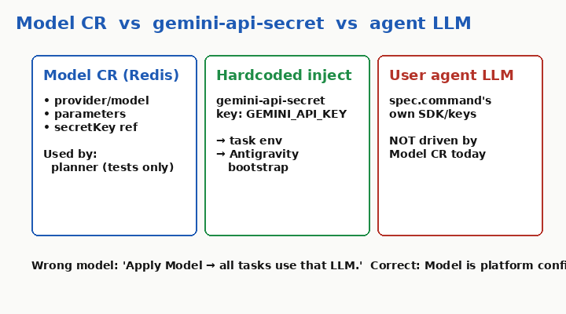
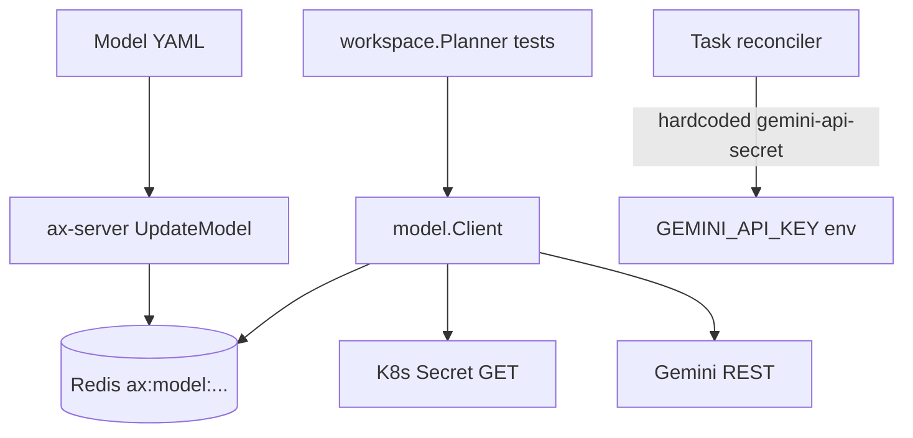

# 04 — Model

## Say this first

A Model object stores provider, model id, parameters, and a secret reference in Redis. Today almost nothing in the hot path reads that object for task bootstrap. The controller injects `GEMINI_API_KEY` from a **hardcoded** Kubernetes secret name `gemini-api-secret`. Your agent’s own LLM is separate.

## Kubernetes analogy (one sentence)

Model is like a ConfigMap plus SecretRef for platform LLM settings — except Tasks do not automatically consume it the way Pods mount a ConfigMap.

### Where the analogy breaks

- No Model CRD — gRPC `UpdateModel` only.
- Reconciler does **not** read Model.secretKey for injection; it calls `lookupGeminiKey` with fixed names. **Confident** — [`reconciler.go`](https://github.com/google/ax/blob/main/internal/controller/reconciler.go) L41–42, L368+.
- Non-google providers: client returns `unsupported provider`. **Confident** — [`internal/model/client.go`](https://github.com/google/ax/blob/main/internal/model/client.go) ~L486–495 (`ProviderGoogle` only path that generates).

## Big picture diagram





## Wrong mental model

**Mistake:** “I applied a Model with Anthropic and secretKey my-key — all tasks now call Anthropic.”

**Correct:** Model CR is stored. Hot-path bootstrap uses `gemini-api-secret` / `GEMINI_API_KEY`. Anthropic in manifests is doc-ahead; Go client only implements google. User `spec.command` brings its own SDK.

## Niche findings

- **Confident** — Defaults in client: provider `google`, model `gemini-3.8-flash`, secret `gemini-api-secret`/`GEMINI_API_KEY`.
- **Confident** — Planner / `NewPlannerFromStore` used in **tests only**; runner does not call planner.
- **Confident** — `parameters.systemInstruction` lifted specially in client.
- **Confident** — Anthropic **not implemented** in `Generate` switch (error for non-google). Upgraded from Unknown.
- **Likely future** — Controller could read Model CR for key name; today hardcoded.
- **Confident** — `TaskStatus.usage` never set from Model calls.

## Junior exercise

**Rotate a key (operator recipe, dry-run thinking):**

1. Note hardcoded names in `lookupGeminiKey` (`gemini-api-secret`, `GEMINI_API_KEY`).
2. Ask: if Model.spec.secretKey points at `my-llm-secret`, does changing that secret affect running tasks? (Answer: **no** until code reads Model or you rename/replace the hardcoded secret.)
3. Confirm with `grep -n gemini-api-secret internal/controller/reconciler.go`.

## One-line definition

A **Model** is a named platform LLM configuration (provider, model id, parameters, secret ref) stored in AX for reuse — partially wired.

## Design

```yaml
apiVersion: ax.io/v1alpha1
kind: Model
metadata:
  name: default-model
spec:
  provider: google
  model: gemini-3.8-flash
  secretKey:
    name: gemini-api-secret
    key: GEMINI_API_KEY
  parameters:
    temperature: 0.9
```

RPCs: `GetModel`, `ListModels`, `UpdateModel`, `DeleteModel`. No status.

### Who consumes Model today?

| Consumer | Uses Model CR? |
|----------|----------------|
| Workspace planner | Yes — **tests only** |
| Antigravity bootstrap | **No** — env `GEMINI_API_KEY` |
| Task reconciler | **No** — hardcoded secret |
| User agent command | **No** — BYO |

## Operator notes

- Put the Gemini secret in the **atespace-as-namespace** the lookup uses. RBAC: controller can get secrets. [`deploy/ax-controller.yaml`](https://github.com/google/ax/blob/main/deploy/ax-controller.yaml).
- Apply Model for future/platform features; do not assume it drives agents.
- After key rotation, tasks mid-bootstrap may need resume/recreate; maiden marker may skip re-bootstrap.

## Open questions

| Item | Tag |
|------|-----|
| Anthropic in Go client | **Confident unsupported** |
| Per-task model select | **Confident no field** |
| Controller←Model for key | **Likely future** |
