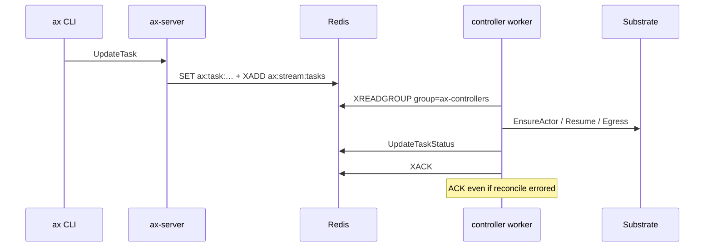
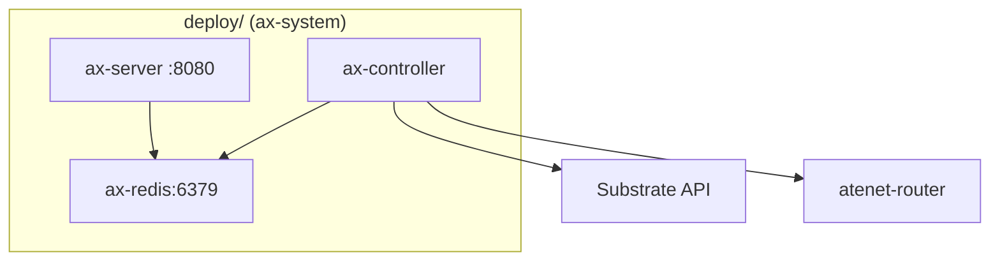

# 05 — Control plane

## Say this first

The control plane is three pieces: `ax-server` (gRPC API), Redis (source of truth + work queue), and `ax-controller` (Stream consumers that drive Substrate). There are no Task CRDs. Scaling throughput means more controller replicas on the same consumer group, healthy Redis, and Substrate capacity — not a bigger etcd.

## Kubernetes analogy (one sentence)

ax-server≈apiserver, Redis≈etcd+workqueue, ax-controller≈controller-manager — but the queue is Redis Streams `XREADGROUP`, not informers.

### Where the analogy breaks

- **No RBAC on Task objects** — who can hit `:8080` can mutate tasks (plus kube access for tunnel/deploy).
- **Confident** — ax-server is `grpc.NewServer()` behind `http.ListenAndServe` — **no TLS/auth middleware** in-tree. CLI dials with `insecure.NewCredentials()`. [`internal/server/server.go`](https://github.com/google/ax/blob/main/internal/server/server.go), [`cmd/ax/main.go`](https://github.com/google/ax/blob/main/cmd/ax/main.go) ~L204.
- Controllers call **external Substrate**, not kubelet.
- Watch closes when phase is Running/Failed/Completed — not “until deleted.”

## Big picture diagram

## Wrong mental model

**Mistake:** “Controllers use a shared informer cache; if reconcile fails the item stays in the queue until success.”

**Correct:** Workers **always ACK** after handling. A bad task becomes Failed in status; the stream moves on. Re-apply to enqueue again. **Confident** — [`worker.go`](https://github.com/google/ax/blob/main/internal/controller/worker.go) ~L64–66.

## Niche findings

- **Confident** — Keys: `ax:task:<atespace>:<name>`; stream `ax:stream:tasks`; pubsub `ax:pubsub:task:…`.
- **Confident** — Initial phase on save: `Pending`.
- **Confident** — Gateway/Workspace/Model saves do not share Task’s stream publish pattern (Gateway: hash+ZADD only).
- **Confident** — Threat model lite: trust boundary = cluster network + who can port-forward to ax-server; no app-level authn on gRPC today.
- **Likely** — Optional store TTL via `Options.TTL` (default unset).
- **Confident** — No leader election — pure consumer group.

## Junior exercise

Without a cluster: open [`DESIGN.md`](https://github.com/google/ax/blob/main/DESIGN.md) and sketch the ASCII architecture onto paper. Then open `internal/store/redis/store.go`, find `SaveTask`, and list the Redis commands in the pipeline (SET / XADD / Publish). Predict what `SaveGateway` does differently (no XADD).

## One-line definition

**ax-server + Redis + ax-controller** reconcile intent into Substrate without etcd Task objects.

## Design

### Binaries

| Binary | Role |
|--------|------|
| `ax-server` | gRPC + `/healthz` :8080 |
| `ax-controller` | Stream consumer → reconcile |
| `ax` | CLI |

### gRPC service AX

Tasks: CRUD + Suspend + Resume + Watch. Gateways/Workspaces/Models: CRUD (no watch). Manifests parsed **client-side**.

### Reconciliation steps

1. EnsureAtespace  
2. EnsureActorTemplateWithImage  
3. EnsureActor  
4. ApplyEgressPolicy  
5. Suspend or Resume  
6. Poll workspace ready  

## Architecture path

Deploy: [`deploy/redis.yaml`](https://github.com/google/ax/blob/main/deploy/redis.yaml), [`deploy/ax-server.yaml`](https://github.com/google/ax/blob/main/deploy/ax-server.yaml), [`deploy/ax-controller.yaml`](https://github.com/google/ax/blob/main/deploy/ax-controller.yaml). `make deploy` builds via ko.

## Operator notes

- Scale controllers with `--redis-group` shared.
- Monitor Redis memory, stream lag, pending entries.
- Set `ATENET_ROUTER_ADDR` for ready polls when worker IP path fails.
- NetworkPolicy ax-server Service — gRPC is powerful and unauthenticated in-app.

## Open questions

| Item | Tag |
|------|-----|
| Redis HA | **Unknown** — single redis:7-alpine in deploy |
| ax-server authn/TLS | **Confident none in-tree** |
| Leader election | **Confident none** |
