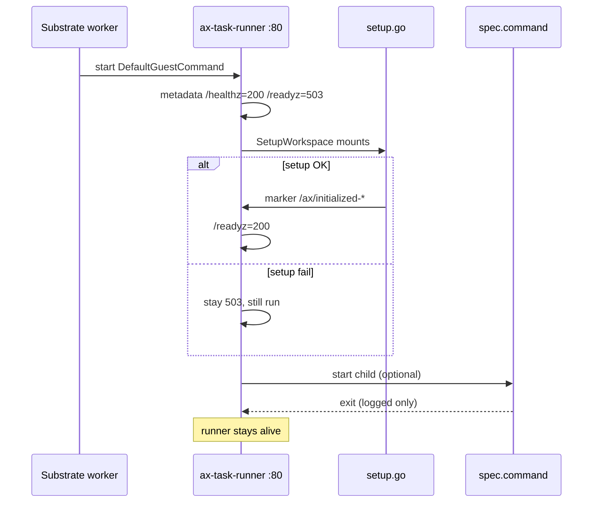

# 06 - Runner / sandbox contract

## Say this first

Every task sandbox runs `ax-task-runner` as PID 1 on port 80. It serves `/healthz` and `/readyz`, does maiden workspace setup, starts `spec.command` as a child, and **keeps running after the command exits**. Debug mode multiplexes guest gRPC for `ax ssh`. Durability is `/workspace` only; the maiden marker under `/ax` is a niche resume hazard.

## Kubernetes analogy (one sentence)

The runner is like a tiny kubelet-plus-entrypoint inside the container: fixed binary path, probes on :80, app process as a child - not the container CMD.

### Where the analogy breaks

- Sandbox class is **gVisor** via Substrate, not default runc. **Confident** - `SandboxClass_SANDBOX_CLASS_GVISOR`.
- `/workspace` durability is Substrate **DurableDir + snapshots**, not a kubelet volume plugin you configure in AX YAML.
- Command exit ≠ container exit ≠ Task Failed.

## Big picture diagram

**Teaching callout - `/ax` vs `/workspace`:**  
Durable volume mount is **only** `/workspace`. Marker lives at `/ax/initialized-…`. Snapshot config uses **DATA** scope on pause/resume. If `/ax` is not in that data, resume can lose the marker and re-run maiden setup into an already-populated workspace. Controller `WorkspaceReady` sticky bit in Redis does **not** stop the runner from re-cloning. Treat as **Likely gap** until Substrate snapshot scope is confirmed out-of-tree.

## Wrong mental model

**Mistake:** “The container runs my command; when it exits the Pod completes.”

**Correct:** Container runs the runner forever (until suspend/delete). Your command is supervised; exit is log + optional `OnCommandExit` hook in-process - control plane never sees it as phase Failed/Completed.

## Niche findings

- **Confident** - DefaultGuestCommand `/usr/local/bin/ax-task-runner`; DefaultPort 80. [`client.go`](https://github.com/google/ax/blob/main/internal/substrate/client.go), [`runner.go`](https://github.com/google/ax/blob/main/runner/runner.go).
- **Confident** - Env: `AX_TASK_YAML`, `AX_WORKSPACES_YAML`, optional `GEMINI_API_KEY`, plus `spec.env`.
- **Confident** - `/readyz` 503 until workspace ready; `/metadata/v1alpha1/ax/task` serves YAML.
- **Confident** - Guest services only if `spec.debug: true`. [`internal/metadata/server.go`](https://github.com/google/ax/blob/main/internal/metadata/server.go).
- **Confident** - `spec.resources` not applied in `BuildActorTemplate`.
- **Likely gap** - `/ax` marker vs durable `/workspace` on resume (see callout).
- **Confident** - MCP not materialized in setup.go.

## Junior exercise

Read [`docs/runner.md`](https://github.com/google/ax/blob/main/docs/runner.md) “Record that setup happened…”. Then open `setup.go` and note `DefaultAXDir`. Open `BuildActorTemplate` and list VolumeMounts. Write one sentence: “Where should the marker live for warm resume?” (Teaching answer: on durable `/workspace` or ensure snapshot includes `/ax`.)

## One-line definition

The **runner** is PID 1 in every task sandbox: metadata/guest on :80, maiden setup, command supervision, stays up after command exit.

## Design - contract table

| Injection | Content |
|-----------|---------|
| Container command | `/usr/local/bin/ax-task-runner` |
| `AX_TASK_YAML` | Full Task YAML |
| `AX_WORKSPACES_YAML` | Workspace YAML stream |
| Volume | Durable `/workspace` |
| Probe | HTTP `/readyz` :80 |

SIGTERM → SIGTERM process group → 10s grace → SIGKILL.

Default image: `gcr.io/ax-substrate/ate-images/ax-task-runner` ([`types.go`](https://github.com/google/ax/blob/main/pkg/apis/v1alpha1/types.go)).

## Architecture path

| Layer | Path |
|-------|------|
| Binary | `cmd/ax-task-runner/main.go` |
| Core | `runner/runner.go` |
| Setup | `internal/workspace/setup.go` |
| Metadata | `internal/metadata/server.go` |
| Template | `internal/substrate/client.go` |

## Operator notes

- Enable `debug: true` only in trusted pools.
- Custom images must keep path + :80 contract.
- `AX_BOOTSTRAP_TIMEOUT` for long goals.
- Do not assume command exit fails the Task - wrap command or scrape logs.

## Open questions

| Item | Tag |
|------|-----|
| `/ax` vs snapshot DATA scope | **Likely gap** |
| Command → Task phase | **Confident no** |
| Resources in template | **Confident not applied** |
