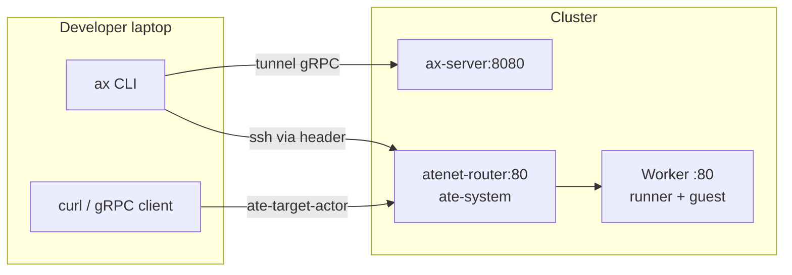

# 07 - Networking (atenet)

## Say this first

Tasks do not get Kubernetes Services. Every request goes through Substrate’s **atenet-router** with header `ate-target-actor: <atespace>/<task>`. That header selects the actor (and may resume it). Separately, the `ax` CLI reaches **ax-server** via kubectl port-forward/tunnel - that path is not atenet.

## Kubernetes analogy (one sentence)

atenet-router is like one ClusterIP Service for all tasks, with a mesh-style header instead of per-Pod Services.

### Where the analogy breaks

- **No stable per-task DNS/IP.**
- Router may **resume suspended actors** on traffic. **Likely** - stated in [`docs/networking.md`](https://github.com/google/ax/blob/main/docs/networking.md); implementation lives in agent-substrate, not google/ax.
- Gateway listeners ≠ inbound path; inbound fronts **worker:80**.

## Big picture diagram

Request path (in-cluster): client → `atenet-router.ate-system` + header → worker running actor → runner :80.

## Wrong mental model

**Mistake:** “I need a Service/Ingress per Task, or Gateway listeners publish my ports.”

**Correct:** One router Service; header selects actor; application still sees normal Host/:authority. Metadata and guest share port 80 (h2c multiplex).

## Niche findings

- **Confident** - Header format `<atespace>/<task>`; actor name = task name. [`docs/networking.md`](https://github.com/google/ax/blob/main/docs/networking.md) (32 lines - thin by necessity).
- **Confident** - Controller polls `workerIP` directly or router + header when `ATENET_ROUTER_ADDR` set. [`reconciler.go`](https://github.com/google/ax/blob/main/internal/controller/reconciler.go).
- **Confident** - `ax ssh` uses [`internal/guest/client.go`](https://github.com/google/ax/blob/main/internal/guest/client.go) `DialTarget` with header.
- **Confident** - CLI→ax-server tunnel is [`internal/tunnel/`](https://github.com/google/ax/blob/main/internal/tunnel/tunnel.go) - different path.
- **Likely** - Auto-resume on inbound (doc claim; Substrate repo).
- **Unknown** - TLS at router; NetworkPolicy between ax-system and ate-system.

## Junior exercise

From [`docs/networking.md`](https://github.com/google/ax/blob/main/docs/networking.md), copy the curl example. Replace `task123` with your task name. Explain in one sentence what happens if that task is Suspended when the curl arrives (doc answer: router resumes first).

## One-line definition

Reach tasks via **atenet-router** + **`ate-target-actor`**, not per-task Services.

## Design

| Caller | Target | Purpose |
|--------|--------|---------|
| Controller | workerIP `/readyz` | Direct poll |
| Controller | router + header | Fallback |
| Laptop curl | PF router | Debug metadata |
| `ax ssh` | guest via router | Exec |

Inside sandbox: `curl $AX_METADATA_URL/...` - no header needed.

## Operator notes

- Deploy Substrate (`ate-system`, `atenet-router`) before expecting task reachability.
- Suspended + inbound traffic ⇒ cost side effect if auto-resume is real.
- `workerIP` may be host:port - reconciler splits with `net.SplitHostPort`.

## Open questions

| Item | Tag |
|------|-----|
| Router auto-resume | **Likely** - Substrate out of tree |
| Router TLS | **Unknown** |
| Gateway listeners vs router | **Likely doc-only** |
