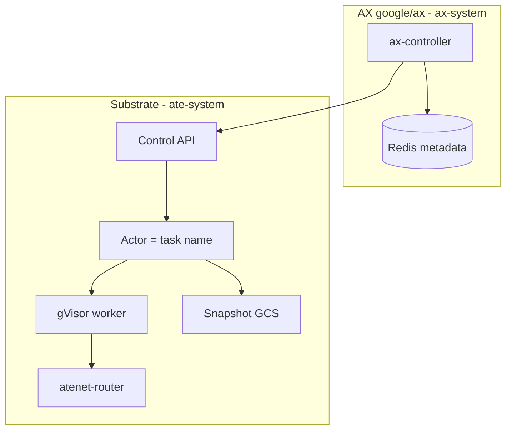

# 08 - Agent Substrate boundary

## Say this first

AX does not run sandboxes. Agent Substrate does. AX stores intent in Redis and calls Substrate’s Control API to create atespaces, actor templates, actors, egress policies, suspend/resume, and delete. Failure domains are split: `ax-system` vs `ate-system`. If Substrate is down, AX metadata can still exist while nothing runs.

## Kubernetes analogy (one sentence)

Substrate is kubelet+CRI+CNI+snapshotter for actors; AX is a specialized control plane that drives it over gRPC.

### Where the analogy breaks

- **Two control planes**, two credentials (AX Redis/gRPC vs Substrate token audience `api.ate-system.svc`).
- Snapshot/GCS and worker pools are **not** configured via Task YAML beyond what `BuildActorTemplate` hardcodes/overrides.
- `spec.resources` never crosses the boundary today.

## Big picture diagram

## Wrong mental model

**Mistake:** “AX owns the whole stack like a distro - if Task is Running, Substrate details are irrelevant.”

**Correct:** Ownership matrix matters for outages. AX can show Running while worker dies until reconcile; Substrate can keep actors while Redis is wrong. Debug both planes.

## Niche findings

- **Confident** - Client wraps `ateapipb`: CreateAtespace, CreateActorTemplate, CreateActor, Resume/Suspend/Delete, egress policies. [`internal/substrate/client.go`](https://github.com/google/ax/blob/main/internal/substrate/client.go).
- **Confident** - Default API `api.ate-system.svc.cluster.local:443`, token `/var/run/secrets/ateapi/token`. [`deploy/ax-controller.yaml`](https://github.com/google/ax/blob/main/deploy/ax-controller.yaml).
- **Confident** - Template: guest command runner, `/readyz` :80, DurableDir `/workspace`, gVisor, snapshots DATA scope + golden resume, bucket overridable `AX_SNAPSHOTS_BUCKET`.
- **Confident** - Crashed actors deleted+recreated in EnsureActor path.
- **Confident** - `spec.resources` not passed.
- **Unknown** - Whether snapshot DATA includes `/ax`; multi-cluster Substrate.

## Junior exercise

Draw two boxes labeled `ax-system` and `ate-system`. Place: Redis, ax-server, ax-controller, Control API, worker, atenet-router, GCS snapshots. Check against the PNG above. Circle the one arrow AX code owns (`internal/substrate`).

## One-line definition

**Substrate** owns sandbox execution; **AX** owns declarative intent and Redis metadata.

## Ownership matrix

| Concern | AX | Substrate |
|---------|-----|-----------|
| YAML kinds in Redis | ✓ | - |
| Actor lifecycle | driver | ✓ |
| `/workspace` volume | runner setup | ✓ durable + snap |
| Egress enforce | Gateway spec | ✓ |
| atenet | consumer | ✓ router |
| Task status phase | ✓ | worker IP signal |

## Operator notes

- Size Substrate workers for concurrency; Redis for metadata QPS.
- Snapshot bucket growth with suspend frequency.
- Template churn per image/env digest - cleanup on delete with retries.
- Deploy AX only after Control API reachable.

## Open questions

| Item | Tag |
|------|-----|
| resources → limits | **Confident not passed** |
| Multi-cluster | **Unknown** |
| `/ax` in snapshots | **Unknown** |
