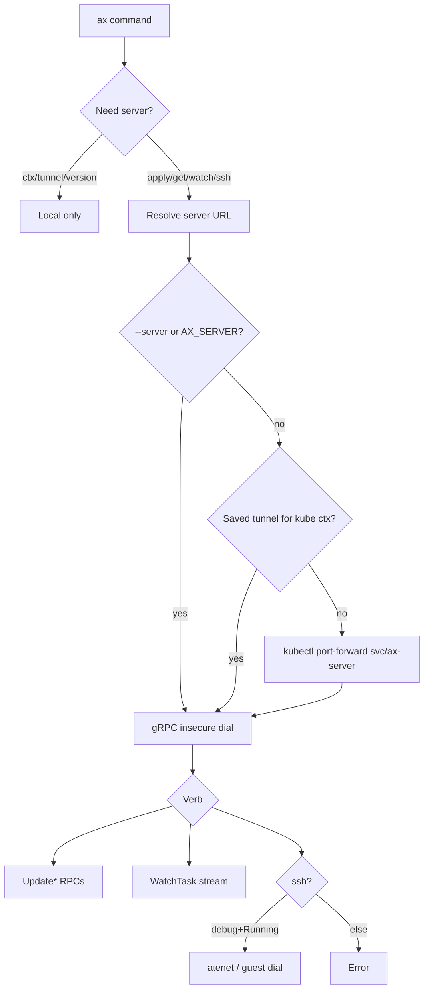

# 09 — CLI and operations

## Say this first

`ax` feels like kubectl: apply, get, watch, delete, plus suspend/resume and ssh. Under the hood it parses YAML locally, opens a tunnel to ax-server gRPC (often kubectl port-forward), and for ssh talks guest protocol via atenet. `-a` is atespace (AX), `-n` is the Kubernetes namespace where AX is installed (`ax-system`).

## Kubernetes analogy (one sentence)

`ax` is kubectl-shaped for four kinds — but ssh is guest gRPC, not `kubectl exec`, and context/tunnel state lives under `~/.ax/`.

### Where the analogy breaks

- No generic API discovery — fixed kinds only.
- `ax ssh` needs `spec.debug: true` and Running phase.
- gRPC to ax-server uses **insecure** credentials in CLI. **Confident** — [`cmd/ax/main.go`](https://github.com/google/ax/blob/main/cmd/ax/main.go) ~L204.
- Watch may stop at `Running` (not only terminal states).

## Big picture diagram



## Wrong mental model

**Mistake:** “`ax delete` is like kubectl delete — object is gone when the command returns; `ax watch` stays until the Job completes.”

**Correct:** Delete is two-phase (Terminating → controller cleans actor). Client may return after mark-deleting; poll get until gone. Watch stops on Running/Failed/Completed — Completed never comes from controller, but Running closes watch early. **Likely/Confident** mix — see drift #7, #16.

## Niche findings

- **Confident** — Tunnel state `~/.ax/tunnels/<context>.json`. [`internal/tunnel/`](https://github.com/google/ax/blob/main/internal/tunnel/).
- **Confident** — Version string mentions standalone redis engine (not git semver). main.go.
- **Confident** — `demo.sh` exists for smoke.
- **Likely** — `ax delete` blocking-until-gone is concepts-doc intent; verify client poll in main.go when teaching live.
- **Unknown** — kubeconfig-less operation; multi-tenant auth to ax-server (none in-tree).

## Junior exercise

Troubleshooting flowchart (no cluster needed — reason it out):

1. `ax get tasks` → connection refused. What three checks? (`ax ctx`, `ax tunnel list`, `--server`/`AX_SERVER`).
2. `ax ssh` → fails on Running task. What YAML field? (`debug: true`).
3. `ax watch` exits while agent still works. Why? (Watch stops at Running.)

## One-line definition

**`ax` CLI** — declarative client, auto-tunnel, agent verbs (`ssh`, `suspend`, `watch`).

## Commands

| Command | Server? |
|---------|---------|
| apply/get/describe/watch/suspend/resume/delete | Yes |
| ssh | Yes + atenet |
| ctx/context, tunnel, version, help | No |

Deploy: `make deploy AX_IMAGE_REPO=...` → redis → ko controller → ko server.

```bash
go install github.com/google/ax/cmd/ax@latest
ax apply -f examples/task.yaml
ax watch task task123
ax ssh task123 -- ls -la /workspace
```

## Operator notes

- Prefer `ax tunnel stop` when switching clusters.
- CI needs path to ax-server (PF or in-cluster).
- Stuck Pending: controller logs + Redis stream pending.

## Open questions

| Item | Tag |
|------|-----|
| ax-server TLS | **Confident none**; CLI insecure |
| delete wait loop | **Likely** |
| Authn multi-tenant | **Unknown** |
