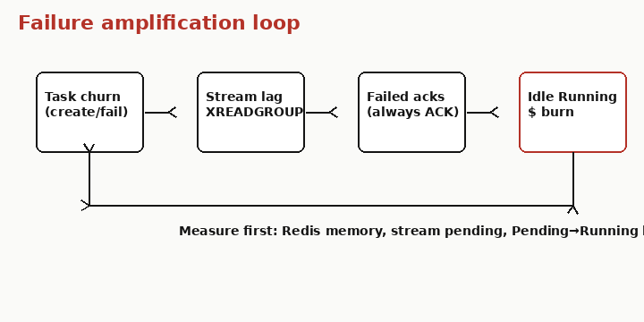
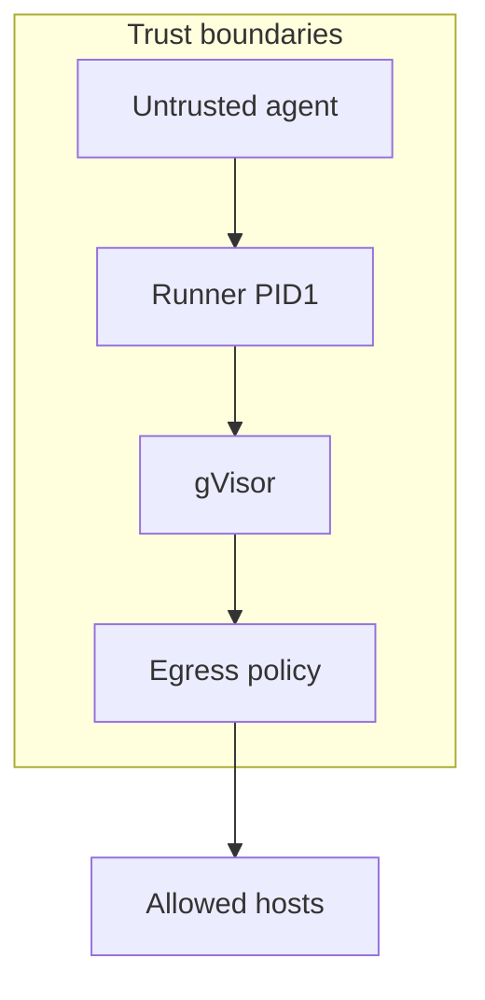

# 10 — Scale and failure modes

## Say this first

At scale you size three things: Redis (memory + stream lag), ax-controller replicas (consumer group throughput), and Substrate workers/snapshots (real CPU/RAM/disk). Agent failures amplify: money loops, idle Running sandboxes, over-broad egress, and split brain between Redis status and actors. “Billions of tasks” is a design slogan — measure stream lag first.

## Kubernetes analogy (one sentence)

Classic etcd/controller/Pod failure modes still exist — remapped to Redis streams, Substrate workers, and suspend snapshots.

### Where the analogy breaks

- `spec.resources` / quotas **do not** protect neighbors today.
- Idle cost is **Running actors + LLM spend**, not only Pod CPU requests.
- Always-ACK workers mean bad tasks don’t wedge the queue — they Fail and move on.

## Big picture diagram

## Wrong mental model

**Mistake:** “If Redis and controllers are fine, we’re scaled — agents can’t hurt us.”

**Correct:** Measure Substrate worker saturation, snapshot GCS growth, Gateway `*` egress, debug=true fleet, and Pending→Running latency. Control plane health ≠ agent blast radius.

## Niche findings

- **Confident** — Always ACK: [`worker.go`](https://github.com/google/ax/blob/main/internal/controller/worker.go) L64–66.
- **Confident** — Watch closes at Running/Failed/Completed: [`server.go`](https://github.com/google/ax/blob/main/internal/server/server.go).
- **Confident** — Default egress `*:443` when no gateway.
- **Confident** — Crash recreate path in substrate client.
- **Likely** — Multi-tenant isolation via atespace is logical; Substrate authz out of tree.
- **Likely** — Billions/task: unbenchmarked; falsify with stream pending, Redis RSS, worker queue depth.

### What to measure first

| Signal | Why |
|--------|-----|
| Redis memory / eviction | Metadata SPOF |
| Stream pending / lag | Controller underprovision |
| Pending→Running histogram | End-to-end reconcile |
| Failed phase rate | Spec vs Substrate errors |
| Substrate worker utilization | Real capacity |
| Snapshot bucket size | Suspend cost |

## Junior exercise

Pick one failure from the catalog below. Write: symptom a junior sees in `ax get`, which plane owns the fix (AX vs Substrate), and one metric you’d graph. Example: Tasks stuck Pending → stream lag → scale ax-controller; metric XPENDING.

## Failure mode catalog

### Control plane

| Mode | Symptom | Mitigation |
|------|---------|------------|
| Redis down | API fails | HA Redis |
| Stream lag | Stuck Pending | ↑ controllers |
| Bad ack | Failed + queue moves | Fix spec, re-apply |
| Delete stuck Terminating | Actor delete errors | Retry; check Substrate |
| Watch ends early | Stream closes at Running | Poll / re-watch |

### Substrate / agent

| Mode | Symptom | Mitigation |
|------|---------|------------|
| Actor crash | Recreate | Idempotent agents |
| Snapshot bloat | Cost/latency | Suspend policy |
| Money loop | API spend | Tight Gateway |
| Idle burn | Running forever | `ax suspend` |
| debug=true | Exec surface | Off in prod |
| Assume resources work | Noisy neighbors | External limits |

## Operator notes

- Blast radius of ax-server access ≈ full task control — NetworkPolicy.
- Suspend does not cancel in-flight LLM calls inside the guest.
- Use [`demo.sh`](https://github.com/google/ax/blob/main/demo.sh) as deploy smoke.

## Open questions

| Item | Tag |
|------|-----|
| Built-in budgets | **Confident unused** |
| Create rate limit | **Unknown** |
| Auto idle detect | **Unknown** — manual suspend |
| atespace authz | **Likely** logical |
