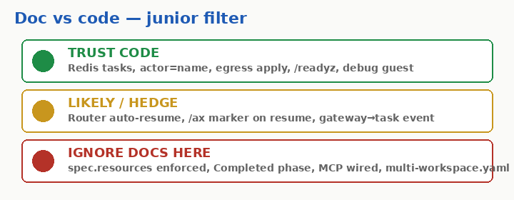
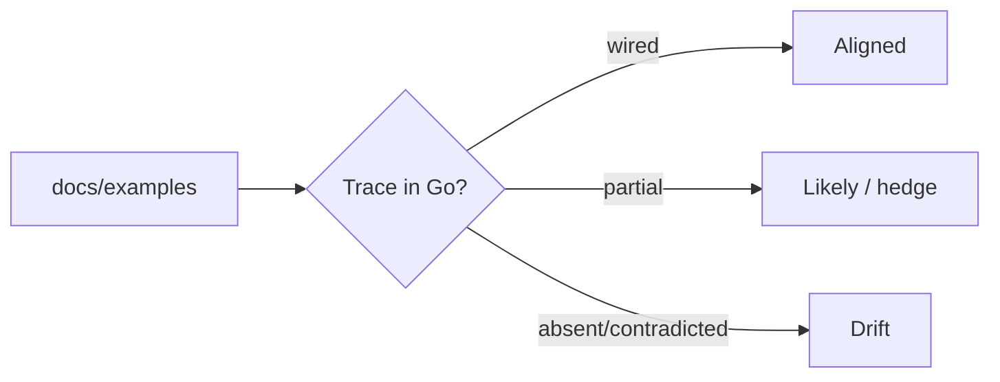

# 11 - Doc vs code drift log

## Say this first

Upstream docs and examples sometimes describe intent ahead of Go code. Trust Redis+controller+substrate client paths over prose. This page is the living register of mismatches. Re-verify after every google/ax main move.

## Kubernetes analogy (one sentence)

Like reading Kubernetes KEPs vs what shipped in your minor version - except here the “API” is Redis/gRPC and the docs live in the same repo as partial implementations.

### Where the analogy breaks

- There is no GA/Beta gate object - v1alpha1 fields can exist with zero wiring.
- Example files can 404 while docs still link them.

## Big picture diagram





## Wrong mental model

**Mistake:** “If it’s in docs/concepts.md or manifests.md, production behaves that way.”

**Correct:** Use the five-bullet filter below, then this table. Code paths in `internal/` win.

### Junior filter - trust this / ignore docs here

1. **Trust:** Tasks in Redis Streams; actor name = task name; egress via `ApplyEgressPolicy`; `/readyz` gating; `debug` for ssh.
2. **Trust:** Two-phase delete Terminating; always-ACK workers.
3. **Ignore / hedge:** `spec.resources` enforcement; MCP/skills registry install; Model CR drives task LLM keys.
4. **Ignore:** `status.phase: Completed` as a real controller state; `HostRule.port` enforcement; Gateway listeners as exposure.
5. **Ignore cite:** `examples/multi-workspace.yaml` - **404 on main** (docs/manifests.md still links it). Use `examples/task.yaml`.

## Niche findings

- **Confident** - `examples/` on main tip `d8ed0fe…`: only `simple.yaml`, `task.yaml`. `multi-workspace.yaml` missing; manifests.md ~L52 stale link.
- **Confident** - Anthropic provider: client errors on non-google (`unsupported provider`) - docs show YAML anyway.
- **Confident** - ax-server: no TLS/auth middleware; CLI insecure dial.
- **Likely** - Gateway save does not enqueue task reconcile.
- **Likely gap** - `/ax` maiden marker vs `/workspace` durable + DATA snapshots.
- **Unknown** - Router auto-resume internals (Substrate repo).

## Junior exercise

Re-verify checklist (clone google/ax @ main):

```bash
# 1. multi-workspace 404
curl -sI https://raw.githubusercontent.com/google/ax/main/examples/multi-workspace.yaml | head -1

# 2. Completed never assigned in reconciler
grep -n 'Phase =' internal/controller/reconciler.go

# 3. Port ignored
grep -n 'h.Port\|Port' internal/substrate/client.go | head

# 4. SaveGateway has no XADD
grep -A25 'func (s \*Store) SaveGateway' internal/store/redis/store.go

# 5. Anthropic unsupported
grep -n 'unsupported provider\|ProviderGoogle' internal/model/client.go
```

Mark each drift row below still true/false after your tip SHA.

## One-line definition

A **verified drift log**: docs/examples vs Go in [google/ax](https://github.com/google/ax).

## How to verify

1. Read claim in `DESIGN.md`, `docs/*`, or `examples/*`.
2. Trace `internal/`, `cmd/`, `runner/`, `pkg/apis/`.
3. Record mismatch with path reference.
4. Note upstream tip SHA when you refresh this table.

**Process after upstream moves:** re-run the junior exercise greps; update rows; bump “verified against” SHA in your notes.

---

## Drift register

| # | Docs / examples say | Code does | Confidence | Evidence |
|---|---------------------|-----------|------------|----------|
| 1 | Task `spec.resources` apply compute | Not passed to ActorTemplate | **Confident** | proto L101 - 108; `BuildActorTemplate` |
| 2 | Gateway `listeners` expose ports | Only egress applied | **Confident** | reconciler `ApplyEgressPolicy` only |
| 3 | MCP registries/servers wired | Git + mkdir skills only | **Confident** | `setup.go` |
| 4 | Skill registries populate path | `MkdirAll` only | **Confident** | `setupSkills` |
| 5 | Model CR drives bootstrap LLM key | Hardcoded `gemini-api-secret` | **Confident** | reconciler L41 - 42, L368 - 384 |
| 6 | Planner in production path | Tests only | **Confident** | `planner_test.go` only callers |
| 7 | `phase: Completed` when done | Never set by reconciler | **Confident** | reconciler phases; watch still refs Completed |
| 8 | Command exit fails task | Logged only | **Confident** | `runner.go` reportExit |
| 9 | pendingApproval / budgets | Reserved / unused | **Confident** | proto reserved fields |
| 10 | `status.usage` token stats | Never written | **Confident** | no controller writer |
| 11 | Tasks as K8s CRDs | Redis + gRPC | **Confident** | DESIGN.md; proto L26 - 27 |
| 12 | `HostRule.port` restricts ports | Ignored in ApplyEgressPolicy | **Confident** | client.go L449 - 490 |
| 13 | Maiden marker survives resume at `/ax` | `/ax` not on DurableDir; snap DATA | **Likely gap** | setup.go AXDir; BuildActorTemplate |
| 14 | Anthropic Model provider | `unsupported provider` unless google | **Confident** | client.go ~L486 - 495 |
| 15 | Gateway update re-applies tasks | SaveGateway no task stream event | **Likely** | redis `SaveGateway` SET+ZADD only |
| 16 | `ax delete` blocks until gone | Mark deleting; client may poll | **Likely** | concepts.md; server MarkTaskDeleting |
| 17 | `examples/multi-workspace.yaml` exists | **404** - only simple.yaml + task.yaml | **Confident** | examples/; manifests.md L52 stale link |
| 18 | ax-server mTLS/authn for clients | Plain `grpc.NewServer` + HTTP; CLI insecure | **Confident** | server.go; cmd/ax/main.go L204 |

---

## Confirmed aligned (not drift)

| Claim | Evidence |
|-------|----------|
| Redis + Streams queue | DESIGN.md, redis store |
| Actor name = task name | reconciler |
| Two-phase delete | server + worker |
| `/readyz` workspace gating | runner + reconciler |
| `spec.debug` gates guest/ssh | metadata + ax main |
| atenet `ate-target-actor` | networking.md + guest client |
| Default task image constant | types.go |
| gVisor sandbox class | BuildActorTemplate |
| Suspend clears workerIP | reconciler |

---

## Maintenance

1. Fix drift in **google/ax** (not this repo), or update docs there.
2. Re-verify paths at new tip SHA.
3. Update or remove rows here.
4. Prefer updating this register before retuning other subjects.

## Open questions (docs only)

| Claim | Source | Tag |
|-------|--------|-----|
| Router auto-resumes on traffic | docs/networking.md | **Likely** - Substrate |
| Billions of tasks per cluster | README, DESIGN | **Likely** - no benchmarks |
| Antigravity required | docs/sandbox.md | **Confident** optional if no key/script |
